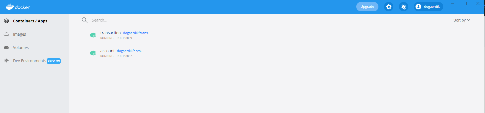
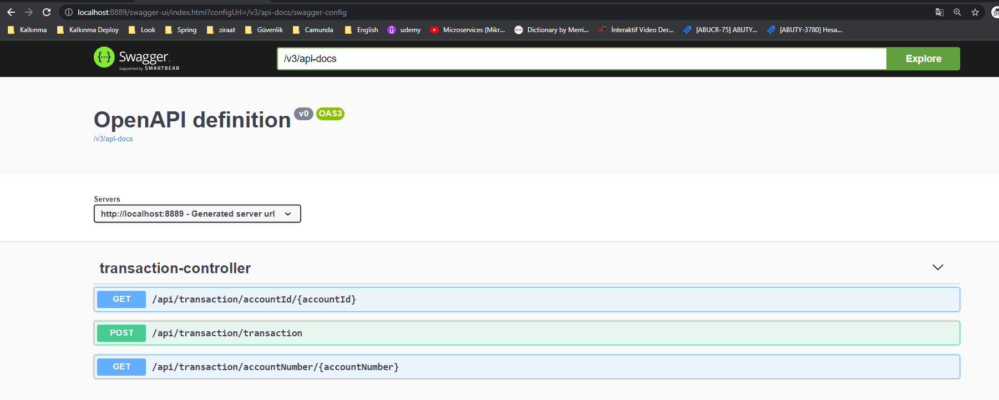
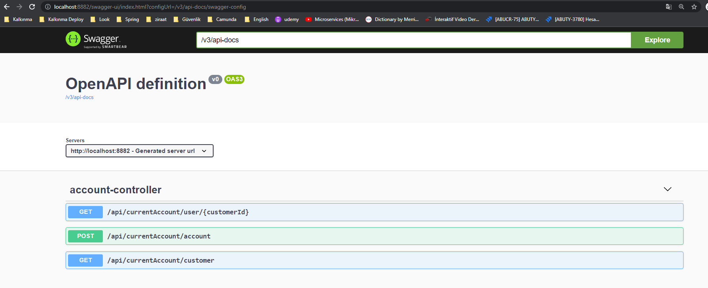

# Doğa Erdik Blue-Harvest Assignment
This project developed for blue-harvest assignment.

###Requirements
- JDK 1.8+
- Maven


### Architecture
The system designed with 2 microservices. Repository Pattern has been used. Hbernate, JPA Data, Junit, Spring Boot, h2-database and Swagger-ui  used for project.  

- transaction
- account

Transaction microservice has 3 end-points. /transaction endpoint saves transaction information. /accountId/{accountId} endpoint gets single transaction info with accountId. /accountNumber/{accountNumber} end point gets transactions infos with account number and you can see account history with that api.

Account microservices also has  3 end-points. /account end point saves account info and later calls transaction microservice /transaction end point for create transacion with RestTemplate. /customer end point has an customer entity for getting sample customer datas. /user/{customerId} end point get account, customer and transaction data entities. Account and customer datas gets with JPA @Queey dsl and transaction infos added with a RestTemplate call.  


### Running the Application
Docker installation is required. You can download and install docker from here https://docs.docker.com/desktop/windows/install/ 

Docker images are published on docker dockerhub.

https://hub.docker.com/repository/docker/dogaerdik/transaction

https://hub.docker.com/repository/docker/dogaerdik/account


1. Download and run docker images from dockerhub

Download and run account microservice on docker 
```
$ docker run -d --name account -p 8882:8882 dogaerdik/account:0.0.1
```

Download and run transaction microservice on docker
```
$ docker run -d --name transaction -p 8889:8889 dogaerdik/transaction:0.0.1
```

### Running the Source Code

1.Clone the repository
```
$ git clone https://github.com/dogaerdik/blue-harvest.git
```

2. Check into transaction microservice
```
$ cd transaction
```

3. Clean maven
```
$ mvn clean
```

4. Run the API
```
mvn spring-boot:run
```
transaction microservice swagger-ui screen.


5. Check into currentaccount microservice
```
$ cd currentaccount
```

6. Clean maven
```
$ mvn clean
```

7. Run the API
```
mvn spring-boot:run
```
Currentaccount microservice swagger-ui screen.
